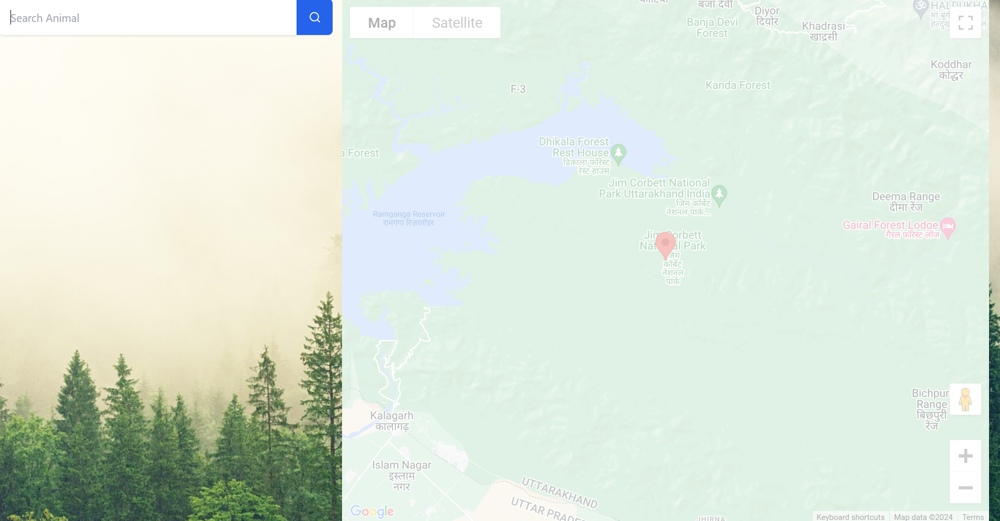
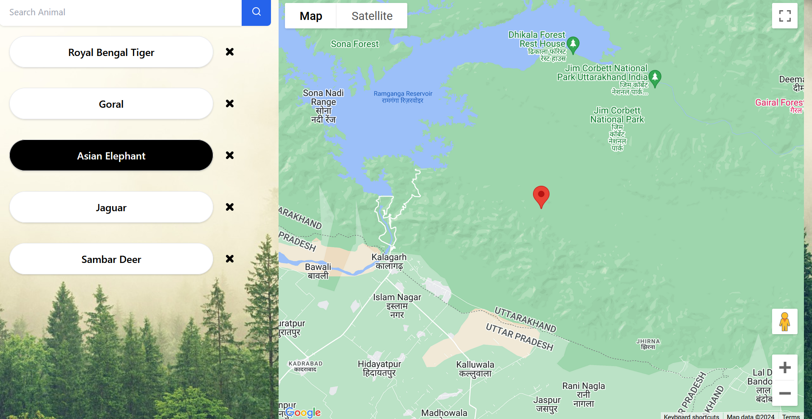
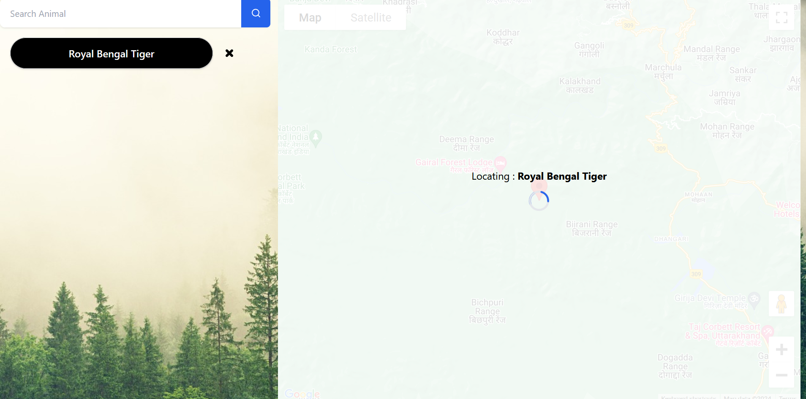

<h3>Table of Contents</h3>
<ul>
    <li><a href="#introduction">Introduction</a></li>
    <li><a href="#overview">Overview</a></li>
    <li><a href="#implementation">Implementation</a></li>
    <li><a href="#installation-and-setup">Installation and Setup</a></li>
    <li><a href="#usage">Usage</a></li>
    <li><a href="#future-work">Future Work</a></li>
    <li><a href="#team">Team</a></li>
</ul>

<h3 id="introduction">Introduction</h3>
<div>
   You set out for the famed Jim Corbett National Park with dreams of catching a glimpse of the majestic Royal Bengal Tiger. However, after hours of wandering through the dense jungle, disappointment settles in as not even a rustle in the bushes hints at the presence of wildlife, let alone the elusive tiger. Your much-anticipated adventure seems to have hit a roadblock. But fear not, I have a solution in hand. How about harnessing tech to track down your favorite anima. And let's not forget the visual spectacle of exploring the rich fauna that reside in these ecosystems.
</div>

<h3 id="overview">Overview</h3>
<div>
   The project is a culmination of inspiration drawn from above, crafted to ensure a fulfilling experience. Explore the rich and diverse fauna inhabiting these habitats. The application developed empowers users to navigate through a curated list of animals, enabling them to select their preferred species and discover them in their habitats.
</div>

<h3 id="implementation">Implementation</h3>
<div>
   I have developed a <b>responsive web application</b> leveraging <b>Vue 3</b> for the frontend in conjunction with <b>Tailwind CSS</b>. 
   <br>
   By designing separate Vue components for the search feature and the map, I created a reactive <code>EventBus</code> object to enable efficient data transfer between them. As a result, the selected animal from the list is communicated to the map component to update the marker's location.
   <br>
   Moreover, I have integrated Google Maps using the <b>Google Maps API</b> to the frontend utilizing <b>vue3-google-map</b> npm package: <a href="https://www.npmjs.com/package/vue3-google-map">https://www.npmjs.com/package/vue3-google-map</a>
</div>
<br>
<div>
   Implementation of <code>EventBus.js</code> for facilitating smooth data exchange between components
   <br><br>

   ```javascript
   import { reactive } from 'vue';
   // creating a reactive EventBus object
   const EventBus = reactive({
      data: null, // property to store the data

      setData(data) { this.data = data },
      getData() { return this.data }
   });

   export default EventBus;
   ```
</div>

<h3 id="installation-and-setup">Installation and Setup</h3>
<blockquote>
   In order to run the application, you will need an API Key for Google Maps integration. If you do not have one already, you can request it from Google Maps Platform by visiting the following link: <br><a href="https://console.cloud.google.com/google/maps-apis/overview">https://console.cloud.google.com/google/maps-apis/overview</a>.
</blockquote>
<br>
<ul>
   <li>
      Clone the git repo using the following command: <code>git clone https://github.com/asood-life/into-the-wild.git</code>
   </li>
   <li>
      Navigate to <code>into-the-wild</code> folder and install the required dependencies by running <code>npm install</code>.
   </li>
   <li>
      Create <code>.env</code> file in the <code>into-the-wild</code> folder and define the variable <code>VUE_APP_API_KEY</code> to store the API KEY for Google Maps integration. Execute <code>npm run serve</code> to start the development server.
   </li>
   <li>Navigate to <code>http://localhost:8080</code> to access the application</li>
</ul>

<h3 id="usage">Usage</h3>
<div>
   Please fell free to explore the website using the following link: <a href="https://into-the-wild.onrender.com/">https://into-the-wild.onrender.com</a>
</div>
<br>
<div>
   Welcome to the Homepage! At the top-left corner, you will find a search box waiting for you. Just type in the name of any animal from the comprehensive list of 25 animals provided below. Once you have found your desired animal, simply click on it to populate the search input and proceed to click the search button.
</div>
<br>

```javascript
animalList = ["Royal Bengal Tiger", "Asian Elephant", "Spotted Deer", "Sambar Deer", "Gharial", "Boar", "Chital", "Pangolin", "Langur", "Goral", "Himalayan Black Bear", "Indian Grey Mongoose", "Leopard", "Cheetah", "Wolf", "Bison", "Nilgai", "Hog Deer", "Crocodile", "Black Panther", "Jackal", "Jaguar", "Sloth", "Fox", "Indian Hare"]
```

<br><br>
<br>
<br>
<div>
   Upon clicking the search button, your desired animal joins a list located to the left of the map. Made a mistake? No problem. Use the cross button positioned next to the animal's name to remove it from the list. Once your list of animals is finalized, you are all set to embark on your exploration.
</div>
<br><br>

<br><br>
<div>
   Choose an animal from the list. Upon selection, the map will locate the animal you selected on the map.
</div>
<br><br>

<br><br>

<h3 id="future-work">Future Work</h3>
<ul>
   <li><b>Waiting Queue Approach</b>: tracking the number of individuals eager to observe the wildlife and monitoring the current occupancy at specific locations is vital for preserving the ambience of these natural ecosystems.</li>
   <li><b>Responsive Design</b>: continuing to enhance the code for responsiveness across different screen sizes and devices.</li>
   <li><b>Centralized Server and Fog Computing</b>: levergaing a central server to store animal locations and efficiently dispatch them to connected devices, resulting in a notable reduction in both latency and overhead.</li>
   <li><b>Marker Clusters</b>: highlight the presence of nearby fauna using cluster of markers based on the user's location.</li>
   <li><b>Dynamic Updates</b>: Exploring dynamic updates to animal locations, for ensuring seamless synchronization between the database and frontend to reflect real-time changes to the user.</li>
</ul>

<h3 id="team">Team</h3>
<div>
    <table>
        <tr align="center">
            <td>
                <br>
                <a href="https://github.com/asood-life">Akshat Sood</a>
            </td>
        </tr>
    </table>
</div>
<hr>
<div>
    Thank you for taking the time to go through this project! If you find it valuable, please consider giving it a ⭐ star. Your support is appreciated and helps others in discovering the project. Should you have any enhancement requests or encounter a bug, please report it in the <a href="https://github.com/asood-life/into-the-wild/issues">Issues</a> section. Your feedback is crucial in improving this project for all.
</div>
