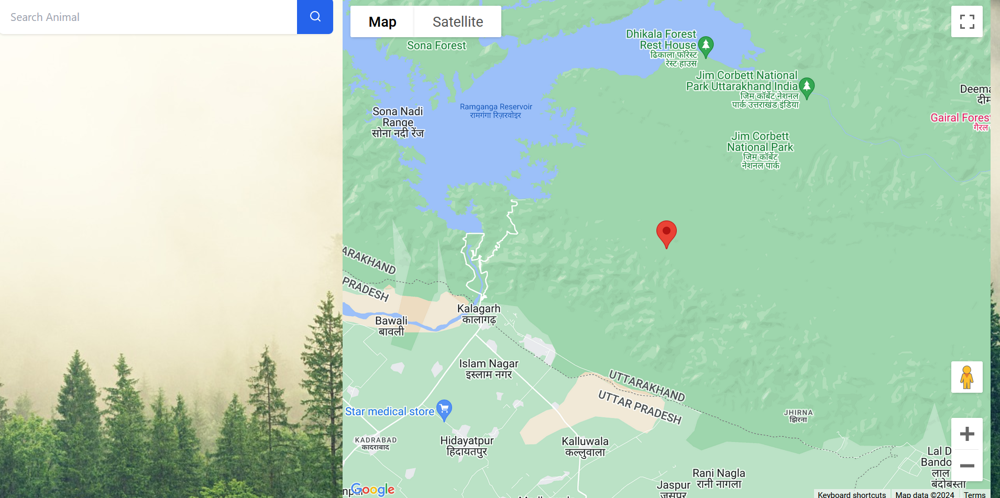

<h2 align="center">Wild Ones - Uncover the Secrets of Wildlife</h2>
<div>You set out for the famed Jim Corbett National Park 🌳 with dreams of catching a glimpse of the majestic Royal Bengal Tiger 🐅. However, after hours of wandering through the dense jungle 🌿, disappointment settles in as not even a rustle in the bushes hints at the presence of wildlife, let alone the elusive tiger. Your much-anticipated adventure seems to have hit a roadblock. But fear not, Wild-Ones has a solution at hand. How about harnessing tech to track down your favorite animal📡. And let's not forget the visual spectacle of exploring the rich fauna 🦌 that reside in these ecosystems. With Wild-Ones, your wildlife adventure transcends the boundaries of traditional exploration, offering a fusion of nature and cutting-edge innovation.</div>

<h3 align>Project Overview</h3>
<div>
   The project is a culmination of inspiration drawn from above, crafted to ensure a fulfilling experience. Explore the rich and diverse fauna inhabiting these habitats. The application empowers users to navigate through a curated list of animals, enabling them to select their preferred species and discover them in their habitats.
</div>
<br>

<div>
   I have developed a <b>responsive web application</b> leveraging cutting-edge technologies. <b>Vue 3</b> is used for the frontend design, <b>MongoDB</b> serves as the database, while <b>Node.js and Express</b> handle the backend operations. To facilitate seamless data transfer between Vue components, I have implemented <b>EventBus</b>. Styling is achieved through <b>Tailwind CSS</b>, ensuring an elegant webpage layout. Moreover, I have integrated Google Maps using the <b>Google Maps API</b> to enhance the frontend experience. (To integrate Google Maps with Vue3, I leveraged <b>vue3-google-map</b> npm package: <a href="https://www.npmjs.com/package/vue3-google-map">https://www.npmjs.com/package/vue3-google-map</a>)
</div>
<br>

<div>
   I have hosted both the frontend and backend on Render, with MongoDB Atlas supporting the database. You can explore the website using the following link: <a href="https://wild-ones.onrender.com/">https://wild-ones.onrender.com</a>
</div>
<br>

<code>EventBus.js</code> facilitates smooth data exchange between components<br>

```javascript
import { reactive } from 'vue';
// creating a reactive EventBus object
const EventBus = reactive({
   data: null, // property to store the data

   setData(data) { this.data = data },
   getData() { return this.data }
});

export default EventBus;
```

The MongoDB database Schema is structured as follows:

```javascript
const mongoose = require('mongoose');

// defining the schema for the animal data
const animalSchema = new mongoose.Schema({
   name: String,
   latitude: Number,
   longitude: Number
});

// creating the Animal model using the schema
const Animal = mongoose.model('Animal', animalSchema);
module.exports = Animal;
```
At present, I have used a script to populate the MongoDB database with animal data. However, the application does not provide real-time updates on the animals locations. Introducing random variations to their coordinates risks pushing them beyond the boundaries of their natural habitat, yielding unintended outcomes. Dynamic updates are indispensable in real-life scenarios, particularly in the field of biologging, where they are crucial for capturing and analyzing animal movement and behavior. 
</div>

<div>Welcome to the Homepage! At the top-left corner, you will find a search box waiting for you. Just type in the name of any animal from the comprehensive list of 25 animals provided below. Once you've found your desired animal, simply click on it to populate the search input and proceed to click the search button.</div>
<br>

<code>animalList = ["Royal Bengal Tiger", "Asian Elephant", "Spotted Deer", "Sambar Deer", "Gharial", "Boar", "Chital", "Pangolin", "Langur", "Goral", "Himalayan Black Bear", "Indian Grey Mongoose", "Leopard", "Cheetah", "Wolf", "Bison", "Nilgai", "Hog Deer", "Crocodile", "Black Panther", "Jackal", "Jaguar", "Sloth", "Fox", "Indian Hare"]</code><br><br>

<br>

<div>Upon selecting your desired animal, it joins a list located to the left of the map. Made a mistake? No problem. Utilize the cross button positioned next to the animal's name to remove it from the list. Once your list of animals is finalized, you are all set to embark on your exploration. Feeling excited?</div>
<br>

<br>

<div>Embark on your adventure by choosing an animal from the list adjacent to the map. Upon selection, the map will locate your chosen animal. Further below, I have included a video walkthrough of the application.</div>
<br>

<h3>Setup Instructions</h3>
<blockquote>
   In order to run the application, you will need an API Key for Google Maps integration. If you don't have one already, you can request it from Google Maps Platform by visiting the following link: <br><a href="https://console.cloud.google.com/google/maps-apis/overview">https://console.cloud.google.com/google/maps-apis/overview</a>.
</blockquote>
<ul>
   <li>Clone the git repo using the following command: <code>git clone https://github.com/asood-life/Wild-Ones.git</code></li>
   <li>Navigate to <code>wild-ones</code> folder and install the required dependencies by running <code>npm install</code>.
   <li>Create <code>.env</code> file in the <code>wild-ones</code> folder and define the variable <code>VUE_APP_API_KEY</code> to store the API KEY for Google Maps integration. Execute <code>npm run serve</code> to start the development server</li>
   <li>Open MongoDB Compass and create a database named <code>wild-ones</code> with a collection named <code>animal-data</code>. As mentioned earlier, insert the following line just after line 24 in <code>server.js</code> to populate the database</code>
      <br><code>const result = await collection.insertMany(animalList);</code>
   <li>In the <code>server</code> folder, create another <code>.env</code> file and define the variable <code>VUE_APP_MONGODB_URI</code> to store the connection string corresponding to the database.</li>
   <li>Update the URL in <code>line 180</code> inside the argument of <code>axios.get</code> to <code>http://localhost:3000/getAnimals</code> since the endpoint will be hosted on your local system during the development.
   <li>Execute <code>node server.js</code> to start the backend server. Afterwards, please comment out the line mentioned above to prevent redundant animal data entries getting stored in your MongoDB database.
   <li>Navigate to <code>http://localhost:8080</code> to access the application</li>
</ul>

<h3>Future Roadmap</h3>
<ul>
   <li><b>Waiting Queue Approach</b>: tracking the number of individuals eager to observe the wildlife and monitoring the current occupancy at specific locations is vital for preserving the ambience of these natural ecosystems.</li>
   <li><b>Responsive Design</b>: continuing to enhance the code for responsiveness across different screen sizes and devices.</li>
   <li><b>Centralized Server and Fog Computing</b>: levergaing a central server to store animal locations and efficiently dispatch them to connected devices, resulting in a notable reduction in both latency and overhead.</li>
   <li><b>Marker Clusters</b>: highlight the presence of nearby fauna using cluster of markers based on the user's location.</li>
   <li><b>Dynamic Updates</b>: Exploring dynamic updates to animal locations, for ensuring seamless synchronization between the database and frontend to reflect real-time changes to the user.</li>
</ul>
<hr>
<div>If you find value in this project, please consider giving it a star ⭐ to show your support. Should you encounter any issues or have suggestions for enhancements, feel free to reach out to me or register them under the <a href="https://github.com/asood-life/wild-ones/issues">Issues</a> section.</div>
